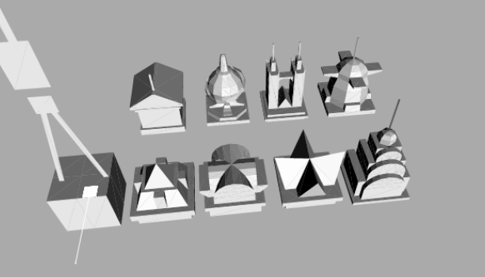
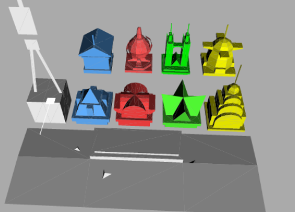
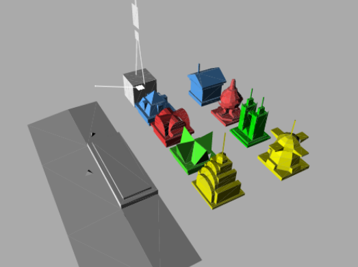

# OpenCityBloxx

**OpenCityBloxx** is an educational reverse-engineering and source reconstruction of the classic Nokia / Digital Chocolate mobile game **City Bloxx** (J2ME / MIDP 2.0 / M3G).

The purpose of this project is software preservation, study of mid-2000s mobile game architectures, and understanding the mathematics and graphics rendering behind early mobile physics and stacking games.

## Preview






---

## Legal & Educational Disclaimer

> [!IMPORTANT]
> **This project is created strictly for non-commercial, educational, historical preservation, and research purposes.**
>
> - **City Bloxx**, **Tower Bloxx**, and all related original trademarks, artwork, sound assets, and game concepts are the intellectual property of **Digital Chocolate** and/or **Nokia**.
> - This repository contains a clean-room style reverse-engineering and decompilation reconstruction created to analyze legacy J2ME algorithms, physics models, and file formats for interoperability and preservation.
> - This project is not affiliated with, endorsed by, or sponsored by Nokia, Digital Chocolate, or any of their successors or affiliates.
> - No copyright infringement is intended. If you are a rights holder and have concerns regarding any material contained in this repository, please contact the maintainers.

---

## Features & Architecture

The codebase has been decompiled, cleaned, and de-obfuscated into readable, maintainable Java classes running on modern desktop JDKs (JDK 11+) via lightweight compatibility wrappers:

- **City Building Mode (`CityMode`)**: Full 5x5 city grid logic, neighborhood synergy scoring, population thresholds, unlocks, and placement impact/smoke animations.
- **Tower Stacking Mode (`House`)**: Crane pendulum and rope physics, wind simulation, block collision detection, combo streaks, citizen parachuting, and roof placement.
- **3D Graphics Subsystem (`Renderer3D`, `Mesh3D`)**: JSR-184 / M3G software emulation layer and camera projections.
- **Audio & Effects (`SoundPlayer`, `Vibra`)**: MIDI audio playback and haptic vibration triggers.
- **Save System & Persistence (`Storage`)**: Record Management System (RMS) persistence for settings, city progress, and high score tables (`HoF`).
- **UI Engine (`Ui`, `MenuController`, `HighScores`)**: In-game HUD, paginated dialogs, softkeys, text wrapping, and leaderboard input.

### Class Mapping Overview

| Original Obfuscated | Reconstructed Class | Description & Responsibilities |
|---|---|---|
| `House` | `House` | Core game loop: tower stacking, crane/rope physics, weather, camera tracking |
| `GameMIDlet` | `GameMIDlet` | MIDlet lifecycle, smooth frame dt loop, global key routing |
| `k` | `CityMode` | City grid mode (5x5 plots, population thresholds, synergies, placement VFX) |
| `a` | `ModalScreen` | Modal screen marker interface |
| `e` | `Screen` | Screen interface (update, paint, key events, transitions) |
| `m` | `ICanvas` | Canvas interface abstraction |
| `p` | `GameCanvas` | Platform canvas implementation |
| `b` | `Vibra` | Haptic vibration abstraction |
| `c` | `PlatformFactory` | Factory for canvas, sound, vibra, and storage components |
| `d` | `Mesh3D` | 3D mesh wrapper |
| `n` | `Renderer3D` | 3D scene rendering, viewport clipping, and matrix projections |
| `o` | `SoundPlayer` | MIDI music player and sound effects |
| `f` | `Storage` | RMS record store persistence (`settings`, `citymode`, `HoF`) |
| `g` | `Resources` | Archive reader (`r0`) and multilingual string table lookup |
| `h` | `HighScores` | Leaderboards, high score formatting, and player name entry |
| `i` | `Ui` | In-game UI, dialogs, softkey controls, and text layout |
| `j` | `MenuController` | Menu definitions loader (`m`), settings, and navigation controller |
| `com.nokia.mid.appl.bloxx.a` | `Lang` | Localization parser and platform validation |

---

## Building and Running

### Prerequisites
- **JDK 11** or newer installed and available on your system `PATH`.

### Build
Run the provided build script:
```cmd
build.bat
```
This compiles the source code with UTF-8 encoding and packages `CityBloxx.jar`.

### Run
Launch the game directly:
```cmd
run.bat
```

### Controls
| Key | Action |
|---|---|
| **Arrow Keys** / **W, A, S, D** | Directional navigation / Move cursor |
| **Enter** / **Space** / **5** | Drop block / Select / Place building |
| **Z** / **F1** | Left Soft Key (Menu / Select / Confirm) |
| **X** / **Esc** / **F2** | Right Soft Key (Back / Exit / Pause) |
| **0 - 9** | Numeric input / Cheats |

### Easter Eggs & Cheats
- In City Mode, enter the classic keypad sequence **`626428826`** on the number keys to unlock all building types and max city level (note: saves are disabled while cheat mode is active to protect progress integrity).

---

## Directory Structure
- `src/` - Reconstructed Java sources and standard compatibility stubs (`jme/`).
- `assets/` - **All game data**, loaded at runtime from this folder (see below).
- `tools/` - Build-time helpers: `M3gToObj.java` (M3G -> OBJ extractor), `migrate_resources.py` (one-time `res/` -> `assets/` migration), `source/models.m3g` (original model file, kept only so the extraction can be re-run).
- `docs/` - In-depth technical documentation (`RESOURCES.md`, `STRING_IDS.md`, `VERIFICATION.md`).

### Assets layout
```
assets/
  manifest.txt          resource id -> file (the game's numeric ids are unchanged)
  images/
    ui/ menu/ title/ hud/ fonts/ city/ tower/ effects/ sky/ badges/    PNG sprites
    icon.png                                                           window icon
  audio/
    music/              title / tower / city themes (MIDI)
    sfx/                drop_miss / drop_good / drop_perfect + 3 spare (MIDI)
  models/
    models.txt          model id -> .obj file
    *.obj *.mtl         the 19 meshes (ground, crane hooks, floors, falling blocks, roofs, bonus roofs)
    textures/*.png      model textures
  lang/                 lang.<locale> string tables
  data/                 menu.dat (menu definitions), res_89.bin
```
The `r0` archive and the numbered loose files are gone; `Resources.getBytes(id)` now looks the id up in `manifest.txt`.

The assets root is searched in this order: `-Dbloxx.assets=<dir>` (or env `BLOXX_ASSETS`), `./assets`, the folder next to the jar/classes, and finally `/assets` inside the jar (the build scripts bundle a copy there). So you can edit/replace any file in `assets/` without recompiling.

### 3D models are OBJ now
The game used to parse a JSR-184 `.m3g` file (resource 90). Meshes were extracted once with `tools/M3gToObj.java` and are loaded by `jme/Model.java` as Wavefront OBJ:
- `v x y z r g b` vertex colours, `vt` UVs (V flipped for normal viewers, flipped back on load), one `g`/`usemtl` per sub-mesh, triangle strips expanded to `f`.
- `.mtl` holds `map_Kd` plus `#@key value` comment lines with the M3G render state (blend, alpha threshold, depth test/write, culling, winding, clamp). Other OBJ tools ignore those lines.
- Standard OBJ files (quads/polygons, `v/vt/vn`, negative indices) also load, so you can edit models in Blender and re-export.
- Verified against the original M3G data: geometry, UVs, vertex colours, render state and textures are identical for all 19 models.

To re-extract: `tools\extract_models.bat` (Windows) or run `M3gToObj <in.m3g> assets/models`.
